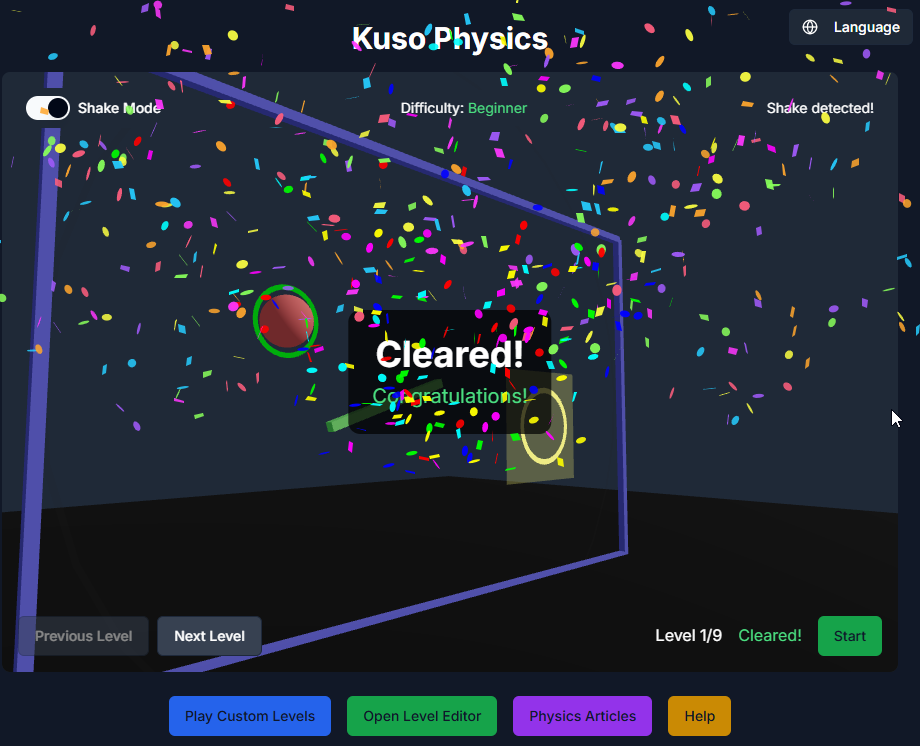

# Kuso Physics

<p align="right">
  <a href="./README.ja.md"       style="margin-right: 10px;">🇯🇵 日本語</a>
  <a href="./README.md">🇺🇸 English</a>
</p>


**Kuso Physics** is a physics-based puzzle game where you guide a ball to its destination by manipulating the environment and applying real-world physics concepts like gravity, friction, and momentum.

DEMO: https://kusogames.github.io/Kuso-Physics/

<!--  -->


---

## 🧪 What is Kuso Physics?

Kuso Physics challenges players with clever level design and realistic ball movement. Players use Shake Mode (via device or mouse movement) to influence the ball's trajectory and solve physics-based puzzles.

---

## 🚀 Getting Started (for Developers)

This is a self-hostable game built with Next.js and uses modern web technologies.

```bash
git clone https://github.com/KusoGames/Kuso-Physics.git
cd Kuso-Physics
npm install
npm run dev
````

This will set up a local development environment.

You can then access the game at `http://localhost:3000`.

## 🚀 Self-Hosting & One-Click Deploy

You can easily fork this repo and run the game on your own environment!

### 1. Fork on GitHub  
[](https://github.com/KusoGames/Kuso-Physics/fork)

After forking, GitHub Actions will automatically build and deploy the site.  
Then just go to your repository **Settings > Pages** and publish the `gh-pages` branch.

---

### 2. One-Click Deploy on Vercel  
[](https://vercel.com/import/project?template=https://github.com/KusoGames/Kuso-Physics)

If you have a Vercel account, deploy the project with a single click.

---

## 🎮 How to Play

1. **Start the Ball** — Press the Start button to begin the simulation.
2. **Guide the Ball** — Shake your device or move your mouse to apply force.
3. **Reach the Target** — Get the ball to the red ring to win.
4. **Reset if Needed** — Hit Reset to retry a level.

---

## 🕹️ Controls

### Mobile
- Shake device to apply force (Shake Mode)
- Touch for Start, Reset, zoom/pan

### Desktop
- Move mouse rapidly to apply force
- Click and drag to rotate, scroll to zoom

---

## 📦 Game Modes

- **Campaign Mode**: Tackle curated levels introducing new mechanics
- **Custom Levels**: Play or share user-generated stages
- **Level Editor**: Create and publish your own puzzle levels

---

## 🧠 Tips and Tricks

- Use momentum to your advantage on slopes
- Bouncier surfaces (pink/purple) help you gain height
- Gentle shaking = better precision
- Study the level layout before launching
- Physics articles available in-game for deeper understanding

---

## ❓ FAQ

- **Q: Shake Mode doesn’t work?**  
  A: Make sure motion permissions are enabled or try using a desktop browser.

- **Q: Can I save and share levels?**  
  A: Yes! Use the Level Editor and share via code or link.

- **Q: Offline play supported?**  
  A: Most features work offline after initial load.

- **Q: Ball got stuck?**  
  A: Hit Reset and try a new approach.

---

## 📄 License

Kuso Physics is licensed under the AGPL-3.0 license.
See `LICENSE` for details.

For commercial licensing, please contact the project founder directly.

---

## 📛 Trademark Notice

"Kuso Physics" is an **unregistered trademark** of the project founder and a part of the **Kuso Games** family of works.

> The name **"Kuso Physics"**, along with its logo and branding elements, are considered an integral part of the project identity.
> Unauthorized use that may cause confusion, suggest affiliation, or imply endorsement by the official project is strictly prohibited.

For more information, see [`trademarks.md`](./trademarks.md).

---

## 💬 Connect

* Project Page: [https://github.com/KusoGames/Kuso-Physics)
* GitHub Issues: [https://github.com/KusoGames/Kuso-Physics/issues](https://github.com/KusoGames/Kuso-Physics/issues)
- For questions, suggestions, or bug reports: Use [https://github.com/KusoGames/Kuso-Physics/discussions](https://github.com/KusoGames/Kuso-Physics/discussions)

---

Enjoy the chaos of physics! 🌌
